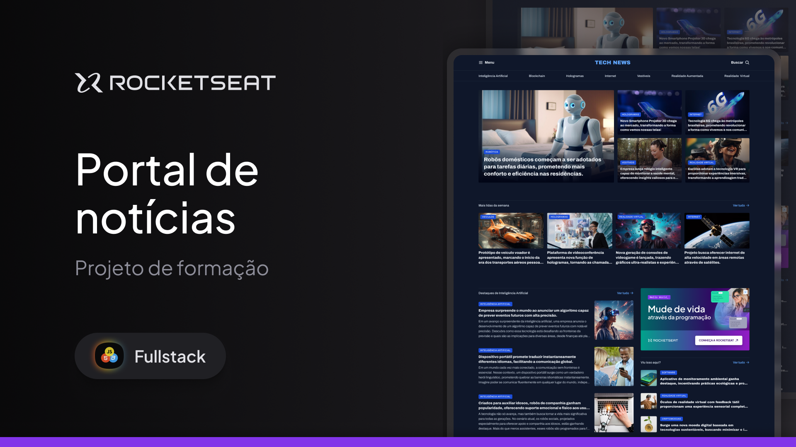

# 📰 Portal de Notícias - Tech News



> Projeto desenvolvido como parte da formação Fullstack da Rocketseat, utilizando **HTML5, CSS3 e CSS Grid** para construção de layouts modernos, organizados e responsivos.

---

## 🚀 Sobre o Projeto

O **Portal de Notícias** é uma aplicação web que simula um site de notícias de tecnologia, trazendo:

- 🧠 Destaques de Inteligência Artificial  
- 🌐 Notícias de Internet e Inovação  
- 🎮 Realidade Virtual e Games  
- 📱 Layout moderno inspirado em portais reais  
- 📐 Estrutura organizada com **CSS Grid**  

Este projeto foi criado para praticar:

- Estruturação semântica com **HTML5**  
- Estilização com **CSS3**  
- Construção de layout com **Grid Layout (CSS Grid)**  
- Organização visual e responsividade  
- Boas práticas de código  

---

## 🖥️ Tecnologias Utilizadas

- HTML5  
- CSS3  
- CSS Grid  
- Git & GitHub  

---

## 📂 Como Executar o Projeto

1. Clone o repositório:
```bash
git clone https://github.com/EloaGuilgel/portal-de-noticias.git
